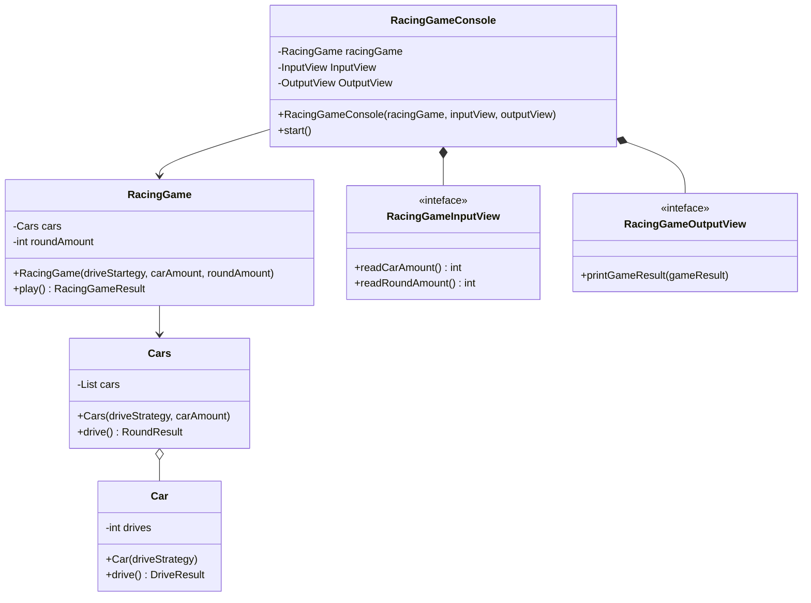
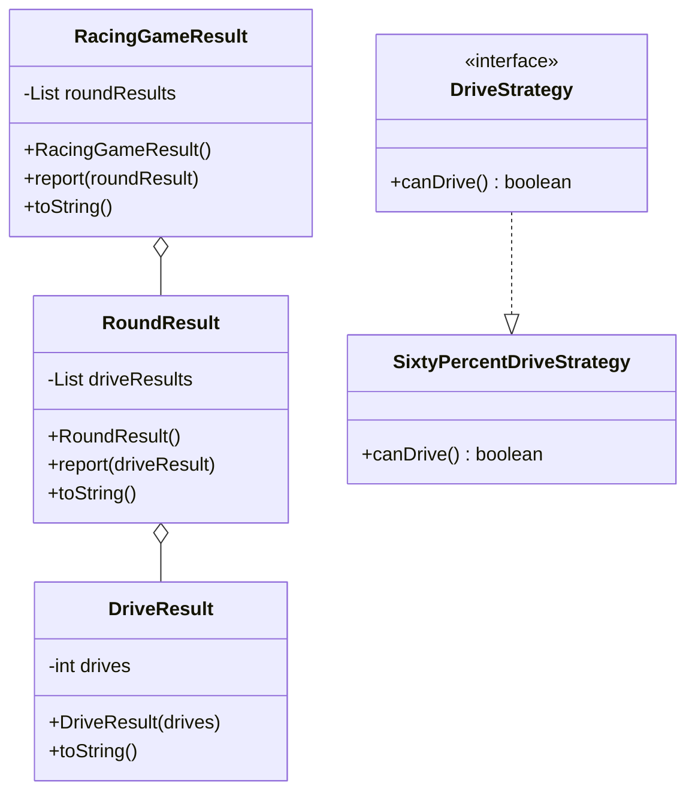

# 자동차 경주 게임

## 기능 요구사항

- [X] 한 자동차가 60% 확률로 전진하고 결과를 반환한다
- [ ] 여러 자동차가 60% 확률로 전진하고 결과를 반환한다
- [ ] 여러 자동차가 여러 번 60% 확률로 전진하고 결과를 반환한다
- [ ] 사용자의 입력을 받아 m대의 자동차가 n번 60% 확률로 전진하도록 하고 게임 결과를 출력한다

## 클래스 다이어그램을 통한 설계

