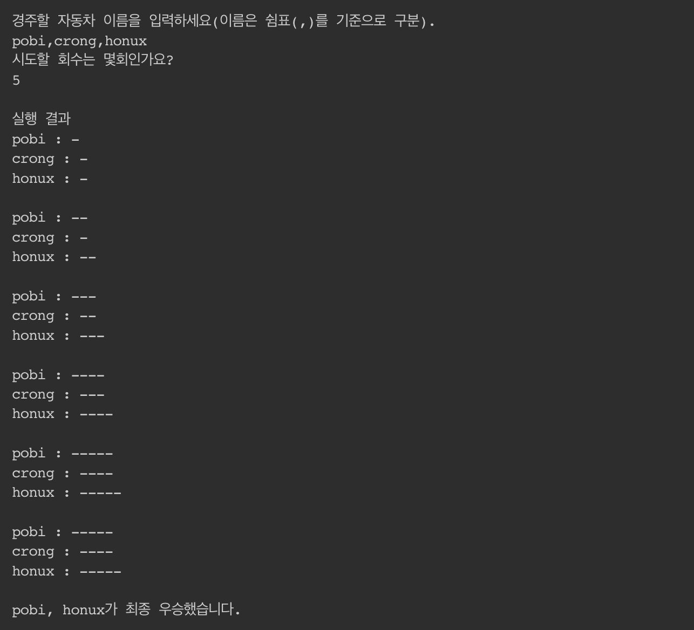

### 🚀 4단계 - 자동차 경주(우승자)
- **기능 요구사항**
  - 주어진 횟수 동안 n대의 자동차는 전진 또는 멈출 수 있다.
  - 사용자는 몇 대의 자동차로 몇 번의 이동을 할 것인지를 입력할 수 있어야 한다.
  - 전진하는 조건은 0에서 9 사이에서 random 값을 구한 후 random 값이 4이상일 경우이다.
  - 자동차의 상태를 화면에 출력한다. 어느 시점에 출력할 것인지에 대한 제약은 없다.
  - 각 자동차에 이름을 부여할 수 있다. 자동차 이름은 5자를 초과할 수 없다.
  - 전진하는 자동차를 출력할 때 자동차 이름을 같이 출력한다.
  - 자동차 이름은 쉼표(,)를 기준으로 구분한다.
  - 자동차 경주 게임을 완료한 후 누가 우승했는지를 알려준다. 우승자는 한명 이상일 수 있다.

- 출력결과
  - 위 요구사항에 따라 3대의 자동차가 5번 움직였을 경우 프로그램을 실행한 결과는 다음과 같다.
  - 

- **기능목록**
  - **자동차게임(입력)**
    -[ ] `자동차 이름 입력은 문자열로 최소 1개의 쉼표(,)를 포함하여야 한다.(최소 자동차 2대 필수)`
    -[ ] `자동차 이름 문자열의 쉼표의 총 갯수는 9개 이상 될 수 없다. (최대 자동차 10대 제한)`
    -[ ] `자동차 이름 문자열의 마지막 끝 문자는 쉼표(,)로 끝날 수 없다.`
    -[ ] `자동차 이름 문자열을 쉼표(,)를 기준으로 split() 후, 문자열의 길이가 5자를 초과 할 수 없다.`
    -[ ] `자동차 게임 시도 횟수는 숫자로만, 입력 할 수 있다.`
    -[ ] `자동차 게임 시도 횟수는 음수 및 0을 입력 받을 수 없다.`
    -[ ] `자동차 게임 시도 횟수는 최대 10번만 가능하다.`
 
  - **자동차게임(모델)**
    -[ ] `자동차 게임은 게임 시도 별로 랜덤값(0~9)를 구한 뒤 각 자동차에게 전진(move)에 전달한다.`
    -[x] `자동차 전진은 입력된 값이 4이상의 경우 position에 1만큼 더해 해준다.`
    -[x] `자동차 전진은 입력된 값이 4미만의 경우 position은 아무 변경 없다. `
    -[x] `자동차 전진에 입력된 값이 음수인 경우 오류 발생 후, 게임은 종료된다.`
    -[x] `각 자동차 중 제일 큰 position를 구한 뒤, position의 값과 동일한 자동차를 우승자로 선정한다.`

  - **자동차게임(출력)**
    -[ ] `자동차 게임 시작을 표기한다.`
    -[ ] `자동차 게임 결과를 자동차이름과 position 수만큼 '-' 문자열로 표기한다. (이름과 posiotion 사이에 ' : ' 문자열을 추가한다.)`
    -[ ] `자동차 게임의 우승자 결과를 표기한다.`
