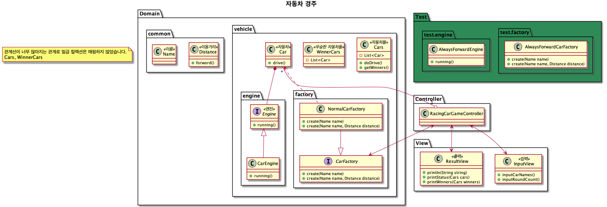

# 자동차 경주 게임

## 진행 방법

* 자동차 경주 게임 요구사항을 파악한다.
* 요구사항에 대한 구현을 완료한 후 자신의 github 아이디에 해당하는 브랜치에 Pull Request(이하 PR)를 통해 코드 리뷰 요청을 한다.
* 코드 리뷰 피드백에 대한 개선 작업을 하고 다시 PUSH한다.
* 모든 피드백을 완료하면 다음 단계를 도전하고 앞의 과정을 반복한다.

## 온라인 코드 리뷰 과정

* [텍스트와 이미지로 살펴보는 온라인 코드 리뷰 과정](https://github.com/next-step/nextstep-docs/tree/master/codereview)

---

## 기능 명세

### Controller

- 자동차 경주를 진행하는 Main

### View

- 사용자 입력
    - 자동차 이름
        - 쉼표로 구분하여 입력
    - 주행 회수
        - 정수만 입력
- 사용자 출력
    - 자동차들을 전달받아 이름과 이동거리를 출력
    - 우승 자동차들을 전달받아 출략

### Domain

- 엔진
    - 주행
        - 0 ~ 9 의 랜덤 값으로 4 미만이면 0, 초과면 1 을 반환
    - 테스트를 위한 엔진 필요
- 자동차
    - 주행
        - 엔진의 결과에 맞는 주행
    - 총 이동거리 저장

### ETC

- VO
    - 이름
        - 0 ~ 5 글자
    - 이동거리
        - 초기 값 0 이상, 이동 가능 값 0 이상
- 일급 컬렉션
    - 이름들
    - 자동차들
        - 기본 자동차들
        - 우승한 자동차들
