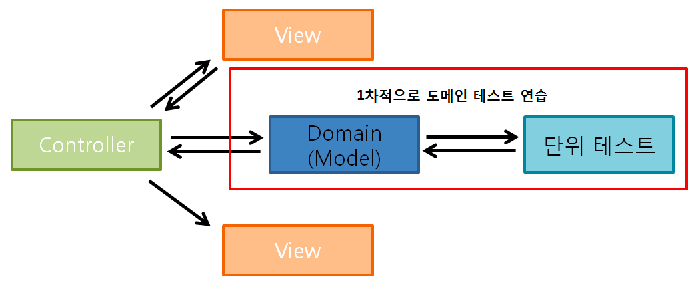
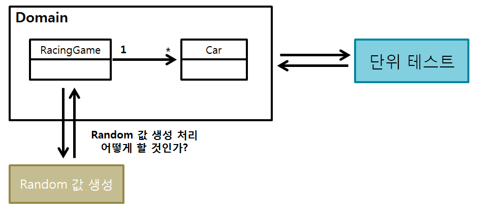

# 🚀 5단계 - 자동차 경주(리팩토링)
## 리팩토링 요구사항
- 핵심 비지니스 로직을 가지는 객체를 domain 패키지, UI 관련한 객체를 view 패키지에 구현한다.
- MVC 패턴 기반으로 리팩토링해 view 패키지의 객체가 domain 패키지 객체에 의존할 수 있지만, domain 패키지의 객체는 view 패키지 객체에 의존하지 않도록 구현한다.

- 테스트 가능한 부분과 테스트하기 힘든 부분을 분리해 테스트 가능한 부분에 대해서만 단위 테스트를 진행한다.

#todo
- [ ] 핵심 비즈니스 로직을 가지는 객체 -> domain 패키지에 구현
- [ ] UI 관련한 객체 -> View 패키지에 구현
- [ ] MVC 패컨 기반으로 리팩토링
  - [ ] view 패키지 객체는 domain 객체 의존가능
  - [ ] domain 객체는 view 패키지 의존하지 않도록 구현
- [ ] 테스트 가능한 부분과, 테스트 하기 힘든 부분 분리
- [ ] 단위 테스트
