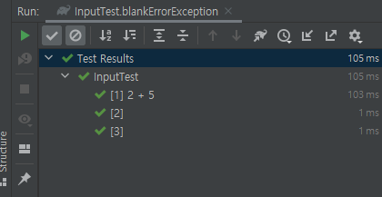

StringCalculator
========================
method 및 클래스 정리
--------------------------
#### `Scanner`
- 객체를 생성하고 읽어들이는 기능
- 실행창에서 값을 입력하고 출력 방식
- java.util 패키지의 Scanner 클래스
- `nextLine` : 입력받은 문자열을 저장
  
##### 실행 코드
```java
// input 출력
public static void main(String[] args) {
    Scanner scanner = new Scanner(System.in);
    System.out.println("input 값을 입력하세요 : ");
    String inputValue = scanner.nextLine();
    System.out.println(inputValue);
}
```
##### 결과

##### scanner 입출력 단위 테스트의 어려움
- 사용자 입출력(UI)과 관련된 테스트는 가능하지만 구현이 어려운 부분 
- 테스트 코드는 컴퓨터가 실행하는 코드라 사용자의 입력이 필요한 스캐너를 만나면 존재하지도 않는 사용자의 입력을 계속 기다리면서 에러발생

<br>

## 예외처리
- 문자를 받으면 `" "`기준으로 분리하는 메소드를 실행
- 빈값을 받으면 테스트가 예외처리하고 테스트를 계속 진행하도록 하기
##### main 클래스 메소드
```java
// 빈값 (null 값 or " ") 판단하기
public Boolean checkBlank(String blankValue) {
    if (blankValue.equals(" ") || blankValue == null) {
    }
    return true;
}

// input값 " "기준으로 split하기
public String[] splitter(String input) {
    return input.split(splitValue);
}

// splitter 테스트할 때, 예외 처리
public String[] blankErrorException(String testInput) {
    if (checkBlank(testInput)) {
        throw new IllegalArgumentException();
    }
    return splitter(testInput);
}
```
##### 테스트 클래스 메소드
```java
// splitter 테스트할 때, 예외 처리 테스트
@ParameterizedTest
@ValueSource(strings = {"2 + 5", "", " "})
void blankErrorException(String testInput) {
    assertThatThrownBy(() -> {
        // given
        Input input = new Input();

        // when
        String[] expected = {"2", "+", "5"};
        String[] actual = input.blankErrorException(testInput);

        // then
        assertThat(actual).isEqualTo(expected);
    }).isInstanceOf(IllegalArgumentException.class);
}
```
##### 실행결과



