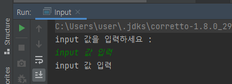

StringCalculator
========================
method 및 클래스 정리
--------------------------
#### `Scanner`
- 객체를 생성하고 읽어들이는 기능
- 실행창에서 값을 입력하고 출력 방식
- java.util 패키지의 Scanner 클래스
- `nextLine` : 입력받은 문자열을 저장
  
##### 실행 코드
```java
// input 출력
public static void main(String[] args) {
    Scanner scanner = new Scanner(System.in);
    System.out.println("input 값을 입력하세요 : ");
    String inputValue = scanner.nextLine();
    System.out.println(inputValue);
}
```
##### 결과



