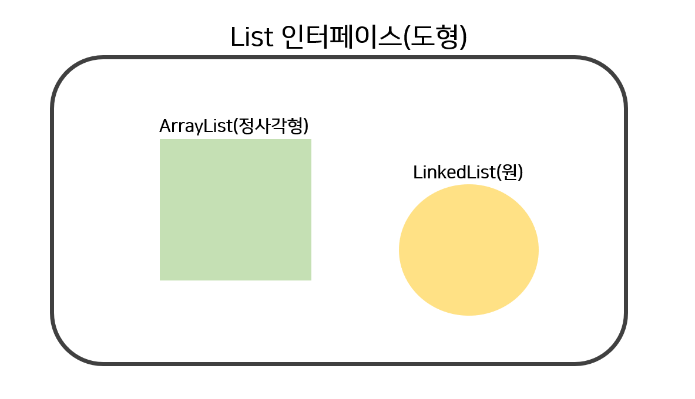

🙌 페어프로그래밍 피드백 정리
===
Ready, Application class 정리 
---

#### 🚩 목차
- 선행학습 : [Car class 피드백 정리][C] 
- Ready class : [cars, 경주용 자동차 목록 생성하기](#cars-경주용-자동차-리스트-생성하기)

[c]: https://github.com/Data-ssung/java-racingcar/blob/ssungwork/mission/racingcar/%ED%8E%98%EC%96%B4%ED%94%84%EB%A1%9C%EA%B7%B8%EB%9E%98%EB%B0%8D_%ED%94%BC%EB%93%9C%EB%B0%B11.md

---

### `cars`, `String[]` 배열을 이용해서 경주용 자동차 목록 생성하기
- `playerList`(e.g `{"s","h","j"}`)를 이용해서 자동차 객체들을 담을 목록(`cars`) 생성하기

✔ 코드 문제1 : `ArrayList` 자료형으로 `car` 객체들을 담을 목록 생성

✔ 코드 문제2 : `cars` 리스트를 생성할 때, 자료형을 지정하지 않아서 `Car` 자료형 말고 `String`도 담을 수 있음 

✔ 코드 문제3 : `cars` 리스트를 생성할 때, index 지정하기 

👉 솔루션1 : List 인터페이스로 자동차 목록를 만들어서 더 유연하게 `cars` 객체를 생성하기   

👉 솔루션2 : `List<Car>` 형태로 자료형 선언하기

👉 솔루션3 : `List`는 index를 지정하지 않아도 되므로 불필요한 index 코드 제거 

#### 솔루션 적용
```java
public class Ready {
    public List<Car> createCars(string[] playerList) {
        List<car> cars = new List<car>;
        for (string player : playerList) {
            cars.add(player);
        }
        return cars;
    }
}
```
#### 자동차 목록 `cars` 생성하기 
```java
public class ReadyTest {
    @Test
    public void createCarsTest() {
        // when     
        private Ready ready = new Ready(); 

         // given 
        String[] palyerList = {"tomas","jason","cindy"};
        List<Car> cars = ready.createCars(palyerList);

        // then
        assertThat(cars).hasSize(3);
    }
}
```
- 테스트를 위해 자동차 목록(`expected`)을 만들기 보다는 확인하고자 하는 `cars`의 크기를 이용해서 메소드 검증하기
- 길이가 5자 넘는 이름는 car 객체를 생성할 때 이미 검증을 하므로, `createCars`는 자동차 목록을 만드는 기능만 집중하면 됨

---

### `cars`, input값 바로 받아서 경주용 자동차 목록 생성하기
- 구현 규칙 : `"s,h,j"` 입력 값을 `,`로 분리하기(`{"s","h","j"}`)
- 입력값 이용해서 자동차 객체들을 담을 목록(`cars`) 생성하기

✔ 코드 문제 : 입력값을 `,`로 분리 작업 후에 `cars` 목록을 생성하므로, 입력값을 처리하지 않고도 `cars` 생성함(구현 규칙 위반)

👉 솔루션 :  `cars` 목록을 생성할 때, 입력값을 처리하는 작업을 같이 진행하도록 설계

#### 솔루션 적용
```java
public class Ready {
    private static final String SPERATE_VALUE = ",";

    public List<Car> createCars(String name) {
        return createCars(seperateName(name)); // 아래의 createCars 호출
    }

    // 외부에서 호출할 필요 없음
    private String[] sperateName(String name) {
        return name.split(SPERATE_VALU);
    }

    public List<Car> createCars(string[] playerList) {
        List<car> cars = new List<car>;
        for (string player : playerList) {
            cars.add(player);
        }
        return cars;
    }
}
```
- `// 외부에서 호출할 필요 없음` : 자동차 목록을 생성할 때, `sperateName`을 사용하기 때문에 외부에서 사용하지 못 하도록 `private` 처리하기 
#### `nmae`을 이용해서 `cars` 생성하기 
```java
public class ReadyTest() {
    private Ready ready = new Ready(); 

    @Test
    public void createCarsByArrayTest() {
        // given 
        String[] palyerList = {"tomas","jason","cindy"};
        List<Car> cars = ready.createCars(palyerList);

        // then
        assertThat(cars).hasSize(3);
    }

    @Test
    public void createCarsByNameTest() {
         // given 
        String[] palyerList = {"tomas,jason,cindy"};
        List<Car> cars = ready.createCars(palyerList);

        // then
        assertThat(cars).hasSize(3);
    }
}
```
- `Ready`에서 자동차 목록을 생성할 때, 이름을 분리작업을 같이 진행하므로 자동차 생성하는 일만 하게 됨
---

### 리팩터링 
#### 인터페이스
- 특정 메소드들을 사용할 것이라고 미리 인터페이스에 선언해두고, 상속 시에 안에 선언된 메소드 중 해당되는 형태에 구현하는 것
- 인터페이스는 껍데기 개념이고, 그 안에 있는 메소드들을 알맹이라고 생각하기
- 참고자료 : [List와 ArrayList][I], [추상클래스와 인터페이스][K]

#### List 인터페이스와 ArrayList
- List는 인터페이스, ArrayList는 클래스
- List 자료형에는 ArrayList, LinkedList 등이 있음
```java
// ArrayList 생성하기
List list = new ArrayList(); 
ArrayList list = new ArrayList(); 
```
- List는 인터페이스이므로 모든 List 자료형을 생성할 수 있음
- ArrayList는 오직 ArrayList 자료형만 생성할 수 있음

- ArrayList를 사용하면 그 형태에 맞게 사용해야 하므로 List로 만드는 것이 더 유연한 객체 생성 방법
- 참고자료 : [리스트와 배열의 차이][H]

[H]: https://st-lab.tistory.com/146
[I]: https://com-on-bappool.tistory.com/49
[K]: https://mainpower4309.tistory.com/10
