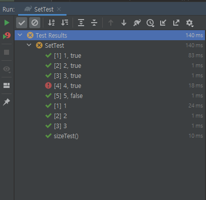

step1. Set Collection에 대한 학습 테스트 
========================
Set Collection에 대한 학습 테스트
----------------------

### 구현 기능 정리 
- 다음과 같은 Set 데이터가 주어졌을 때 요구사항을 만족해야 한다.
    - `Set<Integer>` : integer 객체 생성 메소드, 인덱스가 없음({1,2,3} = {3,2,1}), 중복을 허용하지 않음
    - `new HashSet<>()` : hash 객체 생성
    -  `@BeforeEach` : 클래스에 존재하는 모든 메소드를 실행하기 전에 실행되는 단위
```java
public class SetTest {
    // Set<Integer> = numbers = new HashSet<>();
    private Set<Integer> numbers;

    @BeforeEach
    void setUp() {
        numbers = new HashSet<>();
        numbers.add(1);
        numbers.add(1);
        numbers.add(2);
        numbers.add(3);
    }
    
    // Test Case 구현
}
```
#### 요구사항1
- Set의 `size() 메소드`를 활용해 Set의 크기를 확인하는 학습테스트를 구현한다.

#### 요구사항2
- Set의 contains() 메소드를 활용해 1, 2, 3의 값이 존재하는지를 `코드 중복 없이` 학습테스트 구현한다.
- JUnit의 `@ParameterizedTest`를 활용해 중복 코드를 제거해 본다.
    - `@ValueSource(type = {value1, value2, value3, ...})` : 테스트 값을 미리 셋을 만듦
    - 아래의 함수에 위의 ValueSource를 차례대로 넣어 테스트 실행함
    - 아래의 함수에는 어떤 Type의 값을 넣을지를 input변수 지정해줘여함!!
```java
// 힌트
@ParameterizedTest
@ValueSource(strings = {"", "  "})
void isBlank_ShouldReturnTrueForNullOrBlankStrings(String input) {
    assertTrue(Strings.isBlank(input));
}
```
#### 요구사항3
- 요구사항 2는 contains 메소드 결과 값이 true인 경우만 테스트 가능하다. 
- 입력 값에 따라 결과 값이 다른 경우에 대한 테스트도 가능하도록 구현한다.
- 예를 들어 1, 2, 3 값은 contains 메소드 실행결과 true, 4, 5 값을 넣으면 false 가 반환되는 테스트를 하나의 Test Case로 구현한다.
    - `@CsvSource(value = {"inpu값: 기대값", "inpu값: 기대값", "inpu값: 기대값", ....}' : 테스트 값과 예상되는 결과값을 미리 셋을 만듦
    - 아래의 함수에 위의 CsvSource값을 차례대로 넣어 테스트 실행함
    - 아래의 함수에는 테스트 값과 예상되는 결과값의 타입도 지정해야함!!!!
```java
// 힌트
@ParameterizedTest
@CsvSource(value = {"test:test", "tEst:test", "Java:java"}, delimiter = ':')
void toLowerCase_ShouldGenerateTheExpectedLowercaseValue(String input, String expected) {
    String actualValue = input.toLowerCase();
    assertEquals(expected, actualValue);
}
```

<br/>

### 테스트 구현
```java
package step1;

import org.junit.jupiter.api.BeforeEach;
import org.junit.jupiter.api.Test;
import org.junit.jupiter.params.ParameterizedTest;
import org.junit.jupiter.params.provider.CsvSource;
import org.junit.jupiter.params.provider.ValueSource;

import java.util.HashSet;
import java.util.Set;

import static org.assertj.core.api.Assertions.assertThat;

public class SetTest {
    private Set<Integer> numbers;

    @BeforeEach
    void SetUP() {
        numbers = new HashSet<>();
        numbers.add(1);
        numbers.add(1);
        numbers.add(2);
        numbers.add(3);
    }

    // Test Case 구현
    // 요구사항1
    @Test
    void sizeTest() {
        assertThat(numbers.size()).isEqualTo(3);
    }

    // 요구사항2
    // True 값만 테스트 가능
    @ParameterizedTest
    @ValueSource(ints = {1,2,3})
    void containTest(int inputValue) {
        assertThat(numbers).contains(inputValue);
    }

    // 요구사항3
    // False 값도 테스트 가능
    @ParameterizedTest
    @CsvSource(value = {"1:true", "2:true", "3:true", "4:true", "5:false",}, delimiter = ':')
    void containsTest2(int inputValue, boolean expected) {
        assertThat(numbers.contains(inputValue)).isEqualTo(expected);
    }
}
```
- 실행결과

