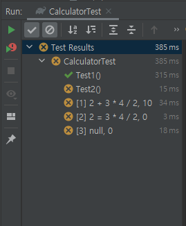

step2.  문자열 사칙 연산 계산기 구현
========================
문자열 사칙 연산 계산기 구현
--------------------------

### 구현 기능 정리 
#### 요구사항
- 사용자가 입력한 문자열 값에 따라 사칙 연산을 수행할 수 있는 계산기를 구현해야 한다.
- 사칙 연산의 계산 우선순위가 아닌 `입력 값에 따라 계산 순서가 결정`된다. 
- 수학에서는 곱셈, 나눗셈이 덧셈, 뺄셈 보다 먼저 계산해야 하지만 이를 무시한다.
- 예를 들어 "2 + 3 * 4 / 2"와 같은 문자열을 입력할 경우 2 + 3 * 4 / 2 실행 결과인 10을 출력해야 한다.

#### 기능 구현 목록
- main 클래스
    1. input: `"2 + 3 * 4 / 2"` String 배열
    2. 사칙연산 기능 구현(덧셈, 뺄셈, 곱셈, 나눗셈)
    3. input 값의 사칙연산 기호 판단하기
    4. 사칙연산 수행하기

- test 클래스

    5. 입력값이 null이거나 빈 공백 문자일 경우 `IllegalArgumentException throw`
    6. 사칙연산 기호가 아닌 경우  `IllegalArgumentException throw`

<br/>

##### tip. 클래스 안에서 함수를 꺼내 쓰기
1. 클래스 인스턴스화
2. 클래스 안의 원하는 함수 꺼내서 사용

<br>

### 기능 구현
#### main 클래스
```java
package step2;

public class Calculator {

    // 기능 구현 목록
    // input 값
    public String[] inputValue(String input) {
        return input.split(" ");
    }

    // 1. 사칙연산 기능
    public int add(int a, int b) { return a + b; }
    public int sub(int a, int b) {
        return a - b;
    }
    public int mul(int a, int b) {
        return a * b;
    }
    public int div(int a, int b) {
        return a / b;
    }

    // 2. 사칙연산 기호 판단
    public String mathSymbol(int a, int b, String c) {
        int temp = 0;
        if (c.equals("+")) {
            temp = add(a, b);
        } else if (c.equals("-")) {
            temp = sub(a, b);
        } else if (c.equals("*")) {
            temp = mul(a, b);
        } else if (c.equals("/")) {
            temp = div(a, b);
        }
        return Integer.toString(temp);
    }

    // 3. 사칙연산 실행
    public String calculation(String input) {
        Calculator calculator = new Calculator();
        String[] testValue = calculator.inputValue(input);
        String temp2;

        for (int i = 0; i < testValue.length - 1; i++) {
            if (i % 2 == 1) {
                int aValue = Integer.parseInt(testValue[i - 1]);
                int bValue = Integer.parseInt(testValue[i + 1]);
                String calValue = testValue[i];

                temp2 = calculator.mathSymbol(aValue, bValue, calValue);
                testValue[i + 1] = temp2;
            }
        }
        return testValue[(testValue.length - 1)];
    }
}
```
#### test 클래스
```java
package step2;

import org.junit.jupiter.api.BeforeEach;
import org.junit.jupiter.api.Test;
import org.junit.jupiter.params.ParameterizedTest;
import org.junit.jupiter.params.provider.CsvSource;

import static org.assertj.core.api.Assertions.assertThat;
import static org.assertj.core.api.Assertions.assertThatIOException;

public class CalculatorTest {
    private String input;

    @BeforeEach
    void Setup() {
        input = "2 + 3 * 4 / 2";
    }

    // testValue = "2 + 3 * 4 / 2" 단위 테스트
    @Test
    void Test1() {
        Calculator calculator = new Calculator();
        String result;

        result = calculator.calculation(input);
        System.out.println(result);
        assertThat(result).isEqualTo("10");
    }

    // 공백이거나 null 값 경우 단위 테스트
    @Test
    void Test2() {
        assertThatIOException().isThrownBy(() -> {
            Calculator calculator = new Calculator();
            final String[] result = new String[1];
            result[0] = calculator.calculation(input);
            assertThat(result[0]).isEqualTo("10");
        }).isInstanceOf(IllegalArgumentException.class);
    }

    // 여러 경우 테스트 실행
    @ParameterizedTest
    @CsvSource(value = {"2 + 3 * 4 / 2:10", "2 = 3 * 4 / 2:0", "     :0"}, delimiter = ':')
    void Test3(String inputValue, String expected) {
        Calculator calculator = new Calculator();
        final String[] result = new String[1];

        assertThatIOException().isThrownBy(() -> {
            result[0] = calculator.calculation(inputValue);
            assertThat(result[0]).isEqualTo(expected);
        }).isInstanceOf(IllegalArgumentException.class);
    }
}
```

- 실행결과
    - 여러 경우 테스트 실행 부분이 결과가 다 예외처리가 됨...


