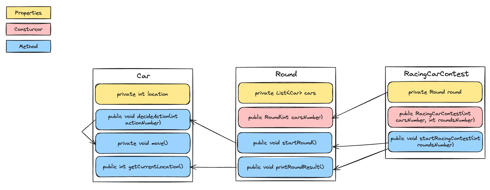

# 3단계 - 자동차 경주

## 기능 요구사항
- 초간단 자동차 경주 게임을 구현한다.
- 주어진 횟수 동안 n대의 자동차는 전진 또는 멈출 수 있다.
- 사용자는 몇 대의 자동차로 몇 번의 이동을 할 것인지를 입력할 수 있어야 한다.
- 전진하는 조건은 0에서 9 사이에서 random 값을 구한 후 random 값이 4이상일 경우이다.
- 자동차의 상태를 화면에 출력한다. 어느 시점에 출력할 것인지에 대한 제약은 없다.

- ## 프로그래밍 요구사항
- 모든 로직에 단위 테스트를 구현한다. 단, UI(System.out, System.in) 로직은 제외
- 핵심 로직을 구현하는 코드와 UI를 담당하는 로직을 구분한다.
- UI 로직을 InputView, ResultView와 같은 클래스를 추가해 분리한다.
- 자바 코드 컨벤션을 지키면서 프로그래밍한다.
- 이 과정의 Code Style은 intellij idea Code Style. Java을 따른다.
- intellij idea Code Style. Java을 따르려면 code formatting 단축키(Windows : Ctrl + Alt + L. Mac : ⌥ (Option) + ⌘ (Command) + L.)를 사용한다.
- else 예약어를 쓰지 않는다.
- 힌트: if 조건절에서 값을 return하는 방식으로 구현하면 else를 사용하지 않아도 된다.
- else를 쓰지 말라고 하니 switch/case로 구현하는 경우가 있는데 switch/case도 허용하지 않는다.

## 기능 목록 및 commit 로그 요구사항
- 기능을 구현하기 전에 README.md 파일에 구현할 기능 목록을 정리해 추가한다.
- git의 commit 단위는 앞 단계에서 README.md 파일에 정리한 기능 목록 단위로 추가한다.
- 참고문서: AngularJS Commit Message Conventions

## 기능 목록

### class Car
- [x] `PROPERTY` `location` : 자동차의 현재 위치
- [x] `METHOD` `decideAction()` : 파라미터를 받아 움직일지 결정한다.
- [x] `METHOD` `getCurrentLocation` : 현재 위치를 반환한다.

### class Round
- [x] `PROPERTY` `cars` : 경주에 참여하는 자동차 리스트
- [x] `METHOD` `startRound()` : 한 라운드를 시작한다.
- [x] `METHOD` `printRoundResult()` : 라운드의 결과를 출력한다.

### class RacingCarContest
- [x] `PROPERTY` `round` : round 객체
- [x] `METHOD` `startRacingContest()` : 자동차 경주를 시작한다.

### InputView
- [ ] `method` `getCarsNumberInput()` : 
  - "자동차 대수는 몇 대 인가요?"를 출력한다.
  - 입력값을 받는다.
  - 받은 입력값을 `int`로 반환한다.
- [ ] `method` `getRoundsNumberInput()` :
  - "시도할 회수는 몇 회 인가요?"를 출력한다.
  - 입력값을 받는다.
  - 받은 입력값을 `int`로 반환한다.