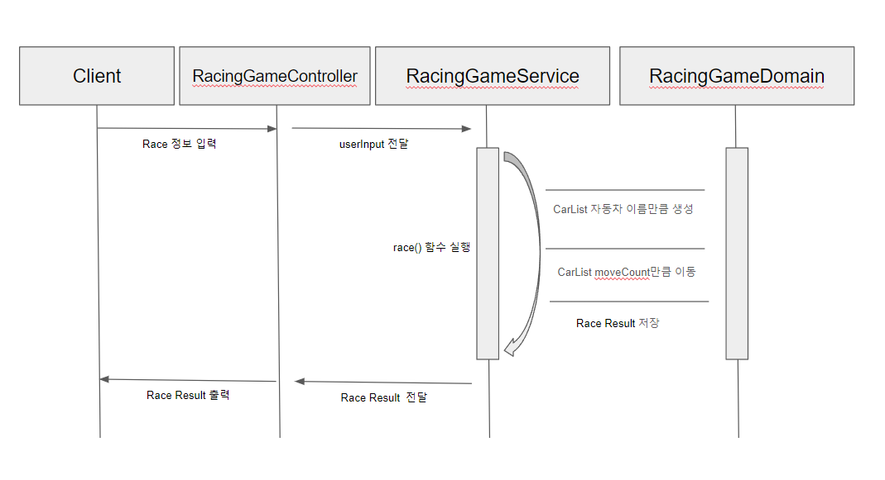

## 기능 요구사항

- 각 자동차에 이름을 부여할 수 있다. 자동차 이름은 5자를 초과할 수 없다.
- 전진하는 자동차를 출력할 때 자동차 이름을 같이 출력한다.
- 자동차 이름은 쉼표(,)를 기준으로 구분한다.
- 자동차 경주 게임을 완료한 후 누가 우승했는지를 알려준다. 우승자는 한명 이상일 수 있다.

## 프로그래밍 요구사항

- indent(인덴트, 들여쓰기) depth를 2를 넘지 않도록 구현한다. 1까지만 허용한다.
    - 예를 들어 while문 안에 if문이 있으면 들여쓰기는 2이다.
    - 힌트: indent(인덴트, 들여쓰기) depth를 줄이는 좋은 방법은 함수(또는 메소드)를 분리하면 된다.
- 함수(또는 메소드)의 길이가 15라인을 넘어가지 않도록 구현한다.
    - 함수(또는 메소드)가 한 가지 일만 잘 하도록 구현한다.
- 모든 로직에 단위 테스트를 구현한다. 단, UI(System.out, System.in) 로직은 제외
    - 핵심 로직을 구현하는 코드와 UI를 담당하는 로직을 구분한다.
    - UI 로직을 InputView, ResultView와 같은 클래스를 추가해 분리한다.
- 자바 코드 컨벤션을 지키면서 프로그래밍한다.
    - 참고문서: https://google.github.io/styleguide/javaguide.html 또는 https://myeonguni.tistory.com/1596
- else 예약어를 쓰지 않는다.
    - 힌트: if 조건절에서 값을 return하는 방식으로 구현하면 else를 사용하지 않아도 된다.
    - else를 쓰지 말라고 하니 switch/case로 구현하는 경우가 있는데 switch/case도 허용하지 않는다.

## 구현할 기능

1. 자동차에 이름을 컴마를 기준으로 부여할수있다.
2. 자동차의 이름은 5자를 초과할 수 없다.
3. 경주게임을 완료한 후 누가 우승했는지 확인할 수 있다.
4. 전진하는 자동차를 출력할 때 자동차 이름을 같이 출력한다.
5. 입력값이 올바르지 않은경우 익셉션을 발생시킨다.
6. 추가 기능 (이름은 중복되거나 빈 값이 들어갈 수 없다.)

## 실행 및 테스트 방법

- 실행
    - RacingGameController 의 main 함수 실행 후 입출력 확인한다.
- 입출력 예시
  
- 테스트
    - step4의 단위 테스트 전체 실행 후 정상동작을 확인한다.

## 프로젝트 구성 / 다이어그램

- JAVA 11버전 이상
- GRADLE
- 내부 클래스 다이어그램
  
- 시퀀스 다이어그램
  

## 라이브러리

테스트에 사용중인 라이브러리는 다음과 같다.

- org.assertj:assertj-core:3.22.0
- org.junit.jupiter:junit-jupiter:5.8.2